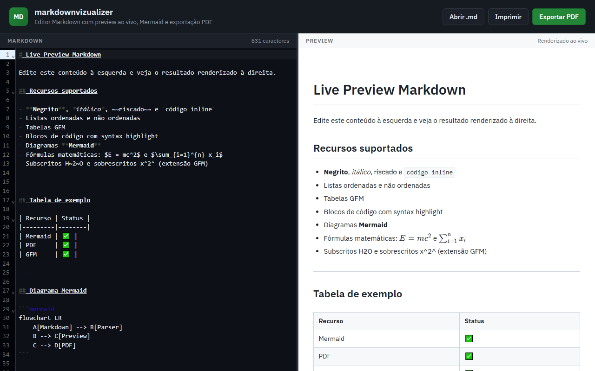
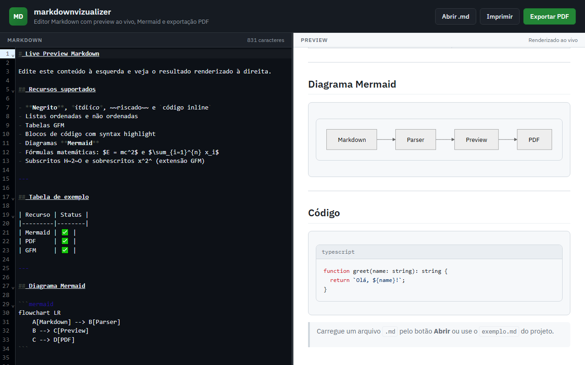
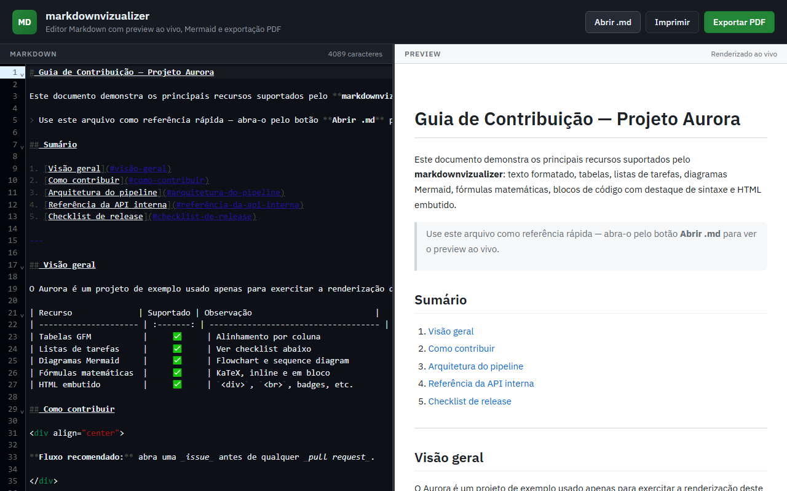
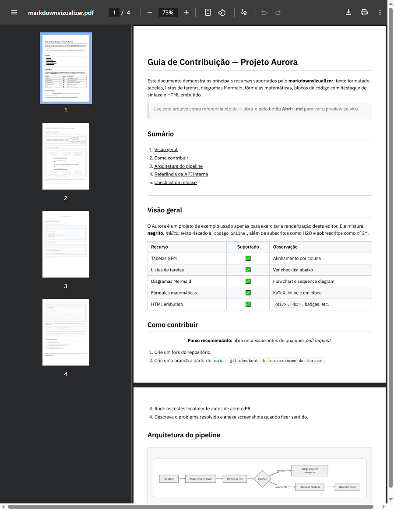

<div align="center">



# markdownvizualizer

**Um editor de Markdown com preview ao vivo em que "Exportar PDF" e "Imprimir" sempre produzem o mesmo resultado, byte a byte — porque usam exatamente o mesmo motor de renderização.**

[](https://react.dev/)
[](https://vitejs.dev/)
[](https://www.typescriptlang.org/)
[](https://codemirror.net/)
[](https://mermaid.js.org/)
[](https://playwright.dev/)
[](LICENSE)

[English](README.md) · **Português (BR)**

</div>

> Uma ferramenta local: sem conta, sem telemetria, nada sai da sua máquina. A única chamada de rede que ela faz é carregar duas fontes do Google Fonts.

---

## Sumário

- [Screenshots](#screenshots)
- [Por que eu construí isso](#por-que-eu-construí-isso)
- [O que ele realmente faz](#o-que-ele-realmente-faz)
- [Recursos](#recursos)
- [Stack técnica](#stack-técnica)
- [Arquitetura](#arquitetura)
- [Decisões de engenharia que vale a pena destacar](#decisões-de-engenharia-que-vale-a-pena-destacar)
- [Estrutura do projeto](#estrutura-do-projeto)
- [Rodando localmente](#rodando-localmente)
- [Roadmap](#roadmap)
- [Licença](#licença)

---

## Screenshots

### Preview ao vivo, sem apertar nenhum botão

Cada tecla digitada no editor re-renderiza o painel da direita na hora — Markdown, tabelas GFM, Mermaid, tudo.


### Diagramas Mermaid e código com destaque de sintaxe, lado a lado com a fonte


_Flowchart renderizado inline, bloco TypeScript com syntax highlight — ambos vindos do mesmo Markdown à esquerda._

### Um documento mais denso: HTML bruto, Mermaid, matemática, tabelas GFM


_Carregado via **Abrir .md** — a `<div>` ao redor de badges, quebras de linha `<br>` em tabela e matemática inline renderizam de verdade, não aparecem como texto literal._

### O PDF exportado, aberto no próprio visualizador de PDF do Chrome


_Texto vetorial e selecionável em todas as páginas — não é uma captura de tela colada dentro de um PDF._

---

## Por que eu construí isso

Eu vivia abrindo arquivos Markdown longos — referências de API, atas de reunião, documentação pela metade — e queria duas coisas ao mesmo tempo: um preview ao vivo enquanto edito, e um PDF limpo pra entregar depois que ficasse exatamente igual ao que eu estava vendo na tela. Toda ferramenta que eu testava resolvia só uma das duas. Extensão de navegador faz preview, mas não exporta. Conversor online exporta, mas exige upload. E a saída que todo navegador já tem embutida — **Imprimir → Salvar como PDF** — na verdade já gera um PDF vetorial perfeito, de graça; só fica escondida atrás de um diálogo de impressão que você precisa clicar manualmente toda vez.

Então a decisão de produto aqui não foi "construir um exportador de PDF". Foi: **o navegador já resolve esse problema; basta ligar um botão "Exportar PDF" no mesmo caminho de renderização, só que sem o diálogo.** Isso é um problema diferente do que parece — uma biblioteca de PDF no cliente não consegue reaproveitar o motor de impressão do próprio navegador, então conseguir um download de um clique que ainda fosse pixel-idêntico ao Imprimir significou recorrer a uma instância real de Chromium headless.

## O que ele realmente faz

1. Você cola ou digita Markdown no painel da esquerda (ou abre um arquivo `.md` pelo botão **Abrir .md**).
2. O painel da direita re-renderiza a cada tecla: tabelas GFM, listas de tarefas, strikethrough, diagramas Mermaid, matemática KaTeX, blocos de código com destaque de sintaxe e HTML bruto embutido no Markdown.
3. **Imprimir** entrega o preview atual direto para o diálogo nativo de impressão do navegador — texto vetorial, paginação respeitando `@page`, zero configuração.
4. **Exportar PDF** faz a mesma renderização, mas através de uma instância real de Chromium headless, disparada por um plugin do Vite, e devolve o PDF pronto como download direto — sem diálogo, sem captura de tela rasterizada colada em um PDF.

---

## Recursos

### Edição & preview
- Split view: editor CodeMirror 6 à esquerda, preview renderizado ao vivo à direita — sem botão "renderizar", sem atraso perceptível.
- Abra qualquer arquivo `.md` local pelo botão **Abrir .md**; o conteúdo é lido no navegador, nada é enviado a lugar nenhum.
- Navegação suave para âncoras de título (`#algum-titulo`) em vez de um salto brusco.

### Markdown, por completo
- GFM: tabelas, listas de tarefas, strikethrough, autolinks.
- Diagramas **Mermaid** (flowcharts, sequence diagrams e qualquer outro tipo suportado pelo Mermaid) renderizados inline como SVG vivo.
- Matemática **KaTeX**, inline e em bloco.
- Blocos de código com destaque de sintaxe (JSON, TypeScript/JavaScript, HTTP) via um tokenizador próprio, em regex, de passagem única — sem biblioteca externa de highlighting.
- Blocos de código sem linguagem reconhecida mantêm a caixa monoespaçada e os espaços/quebras de linha exatos — útil para diagramas em ASCII e saídas de texto puro.
- HTML bruto embutido no Markdown (`<div align="center">`, `<br>`, wrappers de badge, etc.) é interpretado e renderizado, não devolvido como texto literal.

### Exportação
- **Imprimir**: impressão nativa do navegador — o caminho de maior fidelidade que existe, porque *é* o próprio motor de renderização do navegador.
- **Exportar PDF**: um clique, download direto, sem diálogo de impressão — gerado por uma instância real de Chromium headless, então a saída é texto vetorial, não uma imagem rasterizada.
- Os dois caminhos renderizam a partir exatamente dos mesmos dois arquivos CSS, então não existe um "tema de PDF" separado que possa divergir visualmente do que o Imprimir gera.

---

## Stack técnica

| | |
|---|---|
| **React 19 + Vite 6 + TypeScript** | A SPA do editor/preview. |
| **CodeMirror 6** (`@uiw/react-codemirror`) | O painel do editor de Markdown. |
| **react-markdown 9** + `remark-gfm` + `remark-math` + `rehype-katex` + `rehype-raw` | Pipeline Markdown → HTML, incluindo passagem de HTML bruto. |
| **Mermaid 11** | Renderização de diagramas, no navegador, direto para SVG inline. |
| **KaTeX** | Tipografia matemática. |
| **Playwright (Chromium)** | Controla um motor de navegador real no servidor, exclusivamente para exportar PDF — aqui não é uma dependência de teste. |
| **Um plugin próprio do Vite** (`server/pdfExportPlugin.ts`) | Adiciona um endpoint `/api/export-pdf` ao servidor de dev/preview; nenhum processo de backend separado para rodar. |

Nenhuma biblioteca de rasterização client-side (sem `html2canvas`, sem `jsPDF`) — o PDF é gerado pelo motor de impressão de um navegador de verdade, não reconstruído a partir de um bitmap.

---

## Arquitetura

O front-end nunca gera o PDF sozinho — ele entrega o HTML já renderizado para um endpoint same-origin apoiado em um navegador real.

```
                      NAVEGADOR (o próprio app)
                                  │
                     Editor/preview React (ao vivo)
                                  │
                     clique em "Exportar PDF" → POST /api/export-pdf
                     body: { html: <.print-content já renderizado> }
                                  │
                    ┌─────────────▼──────────────┐
                    │  Servidor Vite (dev/preview) │
                    │   server/pdfExportPlugin.ts   │
                    └─────────────┬──────────────┘
                                  │ page.setContent(html + app.css + print.css)
                    ┌─────────────▼──────────────┐
                    │   Playwright · Chromium       │
                    │   headless (mídia print)      │
                    │   page.pdf({ preferCSSPageSize:│
                    │              true })          │
                    └─────────────┬──────────────┘
                                  │ buffer do PDF
                                  ▼
                     Content-Disposition: attachment
                          → download direto do arquivo
```

Como o plugin se registra tanto em `configureServer` quanto em `configurePreviewServer`, o endpoint de exportação funciona tanto em `npm run dev` quanto em `npm run preview` — nenhum processo de servidor extra para subir ou derrubar.

---

## Decisões de engenharia que vale a pena destacar

**O exportador de PDF rasterizava a página — agora ele reaproveita o próprio motor de impressão do navegador.** A primeira versão renderizava o preview num iframe fora da tela, paginava com uma biblioteca client-side e capturava cada página com `html2canvas` antes de colar os bitmaps num PDF. Funcionava razoavelmente para conteúdo simples e quebrava com qualquer coisa real: diagramas Mermaid saíam em branco (`html2canvas` não rasteriza SVG com `<defs>`/`<marker>`/`<style>` embutidos de forma confiável), marcadores de lista perdiam a indentação, e a paginação às vezes descartava uma seção inteira silenciosamente. O conserto não foi ajustar esse pipeline — foi substituí-lo: um plugin do Vite agora sobe um Chromium headless de verdade via Playwright, entrega a ele o mesmo HTML e CSS do preview ao vivo, e chama `page.pdf({ preferCSSPageSize: true })`. A saída é texto vetorial de um motor de layout de navegador real, não uma imagem rasterizada, e cada um desses modos de falha desaparece porque nada está sendo reimplementado — é só o Chrome fazendo o que ele já faz para Imprimir.

**Duas folhas de estilo divergindo era a causa raiz de verdade, não um bug de renderização.** O Imprimir e o (antigo) exportador de PDF tinham cada um seu próprio CSS mantido à mão, e eles foram silenciosamente divergindo: margens de página diferentes, cores de link diferentes, uma regra faltando que acrescenta `(url)` depois de links ao imprimir. O conserto não foi corrigir a folha de estilo do PDF pra bater com a outra — foi apagá-la e fazer a exportação de PDF importar `app.css` e `print.css` diretamente (import `?raw` do Vite), os mesmos arquivos que o Imprimir usa. Agora existe exatamente um lugar para mudar a aparência do que é impresso/exportado, e os dois caminhos não conseguem mais divergir por construção.

**Um bug de tokenizador que só aparecia com template literals.** O destacador de sintaxe rodava quatro passagens de regex sequenciais sobre a própria saída — comentários, depois strings, depois keywords, depois números. Cada passagem podia casar com texto que uma passagem *anterior* já tinha embrulhado em HTML: a lista de keywords incluía `class`, e a passagem de strings acabara de injetar `class="hl-string"` na marcação, então a passagem de keywords casava com esse atributo `class` e o embrulhava de novo, corrompendo a tag. Isso só aparecia com código contendo template literals de crase — comuns o bastante em TypeScript real pra importar. Corrigido ao colapsar as quatro passagens em um único regex com alternância, de modo que nada volta a escanear a saída de outra passagem.

**Uma dependência já estava instalada e simplesmente nunca foi conectada.** `rehype-raw` estava no `package.json` sem uso, então qualquer HTML bruto dentro do Markdown — uma `<div>` de centralização, um `<br>` dentro de uma célula de tabela, o wrapper em volta de um badge — renderizava como texto literal escapado em vez de um elemento. O `react-markdown` v9 já passa HTML bruto adiante na árvore por padrão; faltava só adicionar ao pipeline o plugin que transforma esses nós brutos em elementos de verdade.

**`<pre>` é o único lugar que sabe com certeza "isso é um bloco, não um span inline".** Um bloco de código cercado sem linguagem reconhecida e um `` `trecho de código` `` inline acabam, os dois, como um `<code>` puro sem classe `language-` — indistinguíveis olhando só para o nó `code`. Mas o parser de Markdown só embrulha código *em bloco* dentro de `<pre>`, nunca spans inline, então é o único lugar onde essa distinção é realmente conhecível. Mover a checagem pra lá (em vez de tentar adivinhar dentro do renderer de `code`) corrigiu blocos cercados sem linguagem — como diagramas em ASCII — que perdiam todos os espaços silenciosamente e colapsavam numa linha só.

---

## Estrutura do projeto

```
live-preview/
├── server/
│   └── pdfExportPlugin.ts    # Plugin do Vite: /api/export-pdf, sobe o Chromium headless
├── src/
│   ├── components/
│   │   ├── MarkdownEditor.tsx    # Painel CodeMirror 6
│   │   ├── MarkdownPreview.tsx   # Pipeline do react-markdown + overrides de componentes
│   │   ├── MermaidDiagram.tsx    # Renderiza um bloco ```mermaid como SVG inline
│   │   ├── CodeBlock.tsx         # Destacador de sintaxe em regex, passagem única
│   │   └── Toolbar.tsx           # Abrir .md / Imprimir / Exportar PDF
│   ├── styles/
│   │   ├── app.css               # Estilos base (tela)
│   │   └── print.css             # Regras @media print — compartilhadas com o exportador
│   ├── utils/
│   │   └── pdfExport.ts          # Envia o HTML renderizado, baixa o PDF retornado
│   └── constants/defaultMarkdown.ts
├── exemplo.md                # Documento de exemplo exercitando cada recurso do renderer
└── vite.config.ts
```

---

## Rodando localmente

```bash
npm install
npx playwright install chromium   # uma vez só, necessário para o Exportar PDF
npm run dev
```

Abra a URL local exibida no terminal. O **Imprimir** funciona sem mais nada instalado; o **Exportar PDF** precisa do Chromium baixado acima (o próprio Playwright gerencia o binário — sem depender de um Chrome instalado no sistema).

```bash
npm run build     # tsc -b && vite build
npm run preview   # serve o build de produção; /api/export-pdf continua funcionando aqui também
```

---

## Roadmap

- [ ] Testes automatizados (ainda nenhum — tudo acima foi verificado manualmente com o Playwright controlando o app real)
- [ ] Tema claro/escuro para o painel de preview
- [ ] Exportar também para HTML puro, além do PDF

---

## Licença

Distribuído sob a [Licença MIT](LICENSE) — © 2026 Luis Eduardo.

<div align="center">

Construído por [@merino626](https://github.com/merino626).

</div>
