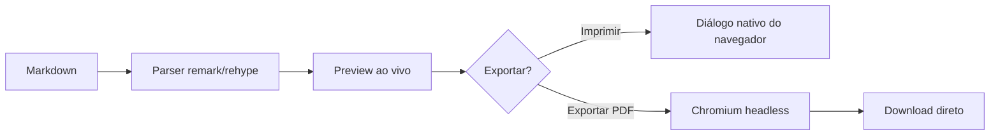
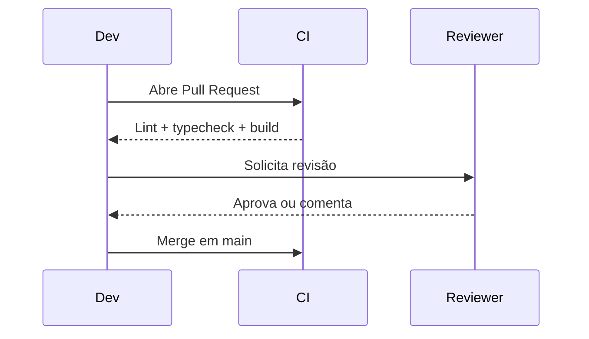

# Guia de Contribuição — Projeto Aurora

Este documento demonstra os principais recursos suportados pelo **markdownvizualizer**: texto formatado, tabelas, listas de tarefas, diagramas Mermaid, fórmulas matemáticas, blocos de código com destaque de sintaxe e HTML embutido.

> Use este arquivo como referência rápida — abra-o pelo botão **Abrir .md** para ver o preview ao vivo.

## Sumário

1. [Visão geral](#visão-geral)
2. [Como contribuir](#como-contribuir)
3. [Arquitetura do pipeline](#arquitetura-do-pipeline)
4. [Referência da API interna](#referência-da-api-interna)
5. [Checklist de release](#checklist-de-release)

---

## Visão geral

O Aurora é um projeto de exemplo usado apenas para exercitar a renderização deste editor. Ele mistura **negrito**, *itálico*, ~~texto riscado~~ e `código inline`, além de subscritos como H~2~O e sobrescritos como x^2^.

| Recurso              | Suportado | Observação                          |
| --------------------- | :-------: | ------------------------------------ |
| Tabelas GFM           |     ✅     | Alinhamento por coluna                |
| Listas de tarefas     |     ✅     | Ver checklist abaixo                  |
| Diagramas Mermaid     |     ✅     | Flowchart e sequence diagram          |
| Fórmulas matemáticas  |     ✅     | KaTeX, inline e em bloco              |
| HTML embutido         |     ✅     | `<div>`, `<br>`, badges, etc.         |

## Como contribuir

<div align="center">

**Fluxo recomendado:** abra uma _issue_ antes de qualquer _pull request_.

</div>

1. Crie um fork do repositório.
2. Crie uma branch a partir de `main`: `git checkout -b feature/nome-da-feature`.
3. Rode os testes localmente antes de abrir o PR.
4. Descreva o problema resolvido e anexe screenshots quando fizer sentido.

## Arquitetura do pipeline



Fluxo de revisão de uma alteração:



A energia cinética aproximada de um pacote de dados trafegando pela rede não importa aqui — mas a fórmula de Einstein sim: $E = mc^2$.

Já a soma de uma série qualquer pode ser expressa em bloco:

$$
\sum_{i=1}^{n} x_i = x_1 + x_2 + \dots + x_n
$$

## Referência da API interna

Exemplo de payload usado nos testes de integração:

```json
{
  "id": "task-001",
  "title": "Corrigir paginação do preview",
  "status": "open",
  "labels": ["bug", "prioridade-alta"],
  "assignee": null
}
```

Requisição HTTP equivalente:

```http
POST /api/v1/tasks
Content-Type: application/json

{ "title": "Corrigir paginação do preview" }
```

Snippet de exemplo em TypeScript:

```typescript
interface Task {
  id: string;
  title: string;
  status: "open" | "closed";
}

function closeTask(task: Task): Task {
  // Idempotente: fechar uma task já fechada não gera erro
  return { ...task, status: "closed" };
}
```

E um diagrama de arquitetura em texto puro, sem linguagem declarada — deve manter o alinhamento monoespaçado:

```
┌────────────┐      ┌────────────┐      ┌────────────┐
│  Markdown  │ ───▶ │   Parser   │ ───▶ │   Preview   │
└────────────┘      └────────────┘      └────────────┘
```

> **Nota:** blocos de código sem linguagem reconhecida ainda preservam espaços e quebras de linha — é justamente isso que este bloco valida.

## Checklist de release

- [x] Preview ao vivo funcionando
- [x] Exportação em PDF gerando o mesmo layout do "Imprimir"
- [x] Diagramas Mermaid renderizando corretamente
- [ ] Cobertura de testes automatizados
- [ ] Suporte a temas claro/escuro no preview

---

Para mais detalhes sobre qualquer um dos recursos acima, veja a [documentação do projeto](https://github.com/merino626/live-preview).
